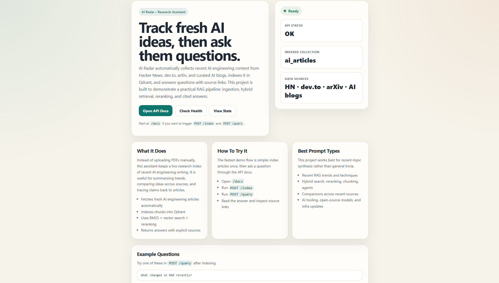
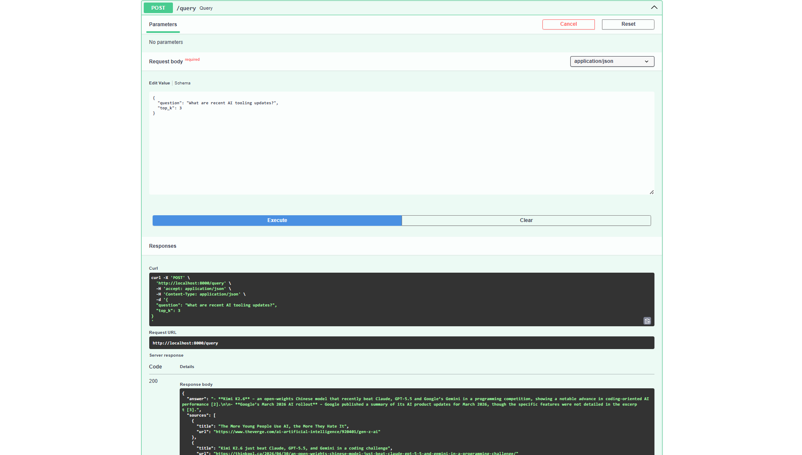
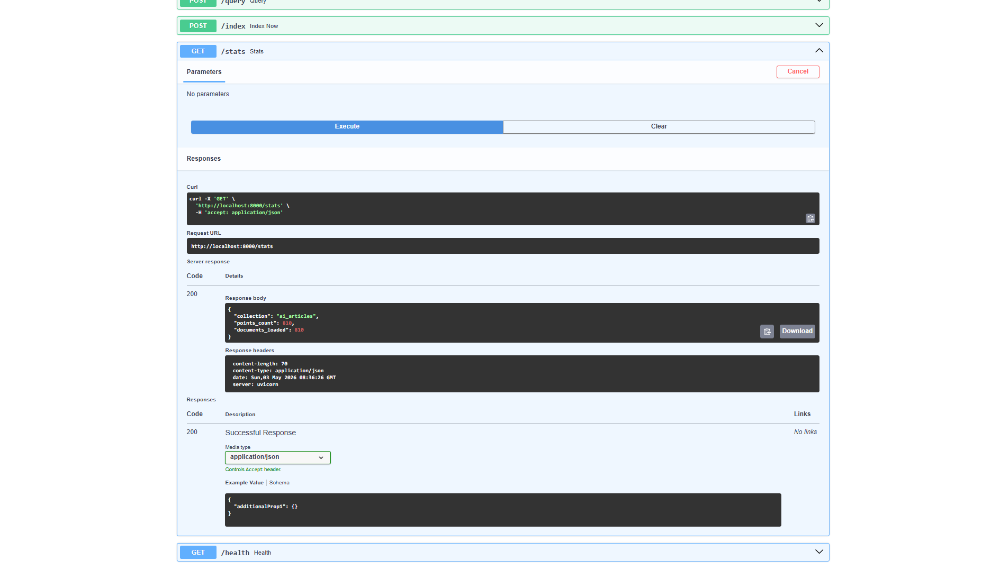
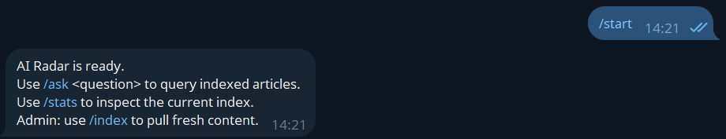
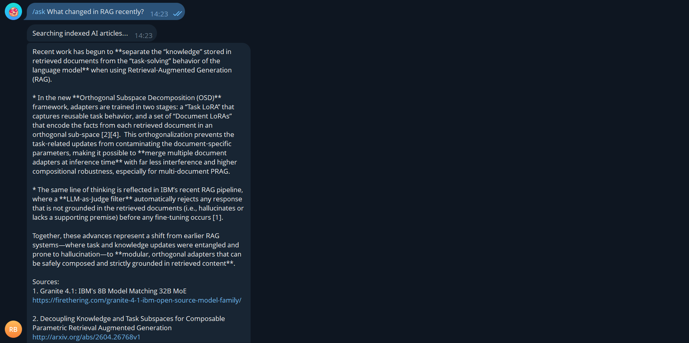
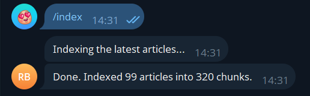

# AI Radar


AI Radar is a RAG-powered research assistant for recent AI engineering content: RAG, LLM apps, agents, open-source models, model tooling, and applied ML infrastructure.

Instead of uploading documents manually, AI Radar continuously ingests fresh AI content from public sources, indexes it into Qdrant, and answers questions with source links.

## Current Version

`v1.0.0` is the first stable release of AI Radar:

- Live ingestion from Hacker News, dev.to, arXiv, Hugging Face, OpenAI, Google AI, and Simon Willison.
- Qdrant-backed vector index with OpenRouter embeddings.
- Hybrid retrieval using BM25 plus dense vector search.
- Reciprocal Rank Fusion and cross-encoder reranking.
- FastAPI API with Swagger docs and a lightweight landing page.
- Telegram bot with admin-only indexing commands.
- RAGAS evaluation over 10 AI engineering questions.
- Docker Compose setup for Qdrant.
- Test and lint workflow in GitHub Actions.

## Why This Project Exists

AI engineering changes too quickly to follow by manually checking blogs, papers, and discussion sites. AI Radar turns recent AI engineering content into a searchable research layer.

It is designed for questions like:

- What changed in RAG recently?
- Which sources discuss hybrid search or reranking?
- What new open-source model or AI tooling updates appeared recently?
- What are recent trends in agentic AI tooling?
- Which recent papers mention LLM inference or retrieval infrastructure?

## What It Demonstrates

This project is intentionally more than a basic "upload a PDF and ask questions" tutorial.

- Automatic ingestion from multiple live sources.
- Hybrid retrieval with keyword and semantic search.
- Cross-encoder reranking for better context selection.
- Source-grounded answer generation.
- RAGAS evaluation over a 10-question AI engineering test set.
- Practical API architecture with FastAPI, Qdrant, Docker, and CI.

## Screenshots

### Landing Page



### Query Demo



### Indexed Collection Stats



### Telegram Bot Start



### Telegram Query Demo



### Telegram Admin Indexing



## Sources

AI Radar currently indexes:

- Hacker News top stories filtered for AI engineering topics.
- dev.to articles from AI, ML, LLM, Python, and open-source tags.
- arXiv papers about RAG, LLMs, agents, embeddings, inference, and ML systems.
- Hugging Face Blog.
- OpenAI News RSS.
- Google AI Blog RSS.
- Simon Willison's feed for LLM tooling and applied AI notes.

All added sources are free public feeds or APIs. No paid news API is required.

## Architecture

```text
                    /ask
Telegram Bot  ---------------->  FastAPI
                                  /query
                                  /index
                                  /stats
                                  /health
                                     |
                 +-------------------+-------------------+
                 |                   |                   |
          Ingestion Layer      Retrieval Pipeline       Qdrant
          HN/dev.to/arXiv      BM25 + Vector Search     Vector DB
          AI RSS feeds         RRF + Reranker           Chunk storage
```

## Retrieval Flow

```text
Question
   |
   +--> BM25 keyword retrieval
   |
   +--> Qdrant vector retrieval
   |
   +--> Reciprocal Rank Fusion
   |
   +--> Cross-encoder reranking
   |
   +--> LLM answer with source citations
```

## Tech Stack

- Python 3.11
- FastAPI
- Qdrant
- LangChain document primitives
- OpenRouter for chat and embedding APIs
- rank-bm25
- sentence-transformers cross-encoder reranker
- aiogram Telegram bot
- RAGAS evaluation scaffold
- Docker Compose
- pytest and ruff

## Project Layout

```text
src/
  api/          FastAPI app and schemas
  bot/          Telegram bot handlers
  ingestion/    source fetchers, scheduler, Qdrant indexing
  retrieval/    hybrid search, reranking, answer pipeline
evals/          RAGAS evaluation entrypoint
tests/          unit tests
```

## Quick Start

Create a virtual environment and install dependencies.

```powershell
python -m venv .venv
.venv\Scripts\Activate.ps1
pip install -r requirements.txt
```

Create `.env`.

```powershell
copy .env.example .env
```

Minimum required `.env` values:

```env
OPENROUTER_API_KEY=sk-or-...
OPENROUTER_BASE_URL=https://openrouter.ai/api/v1
CHAT_MODEL=openrouter/free
EMBEDDING_MODEL=nvidia/llama-nemotron-embed-vl-1b-v2:free
QDRANT_URL=http://localhost:6333
TELEGRAM_BOT_TOKEN=
TELEGRAM_ADMIN_IDS=123456789
```

Start Qdrant.

```powershell
docker compose up qdrant -d
```

Start the API.

```powershell
python main.py
```

Open:

- Landing page: `http://localhost:8000`
- API docs: `http://localhost:8000/docs`
- Health check: `http://localhost:8000/health`

## Basic Demo Flow

Check that the API can reach Qdrant.

```powershell
Invoke-RestMethod http://localhost:8000/health
```

Index fresh content.

```powershell
Invoke-RestMethod -Method Post http://localhost:8000/index
```

Ask a question.

```powershell
Invoke-RestMethod `
  -Method Post http://localhost:8000/query `
  -ContentType "application/json" `
  -Body '{"question":"What changed in RAG recently?","top_k":5}'
```

Check index stats.

```powershell
Invoke-RestMethod http://localhost:8000/stats
```

## Telegram Bot

Set `TELEGRAM_BOT_TOKEN` and `TELEGRAM_ADMIN_IDS` in `.env`, then run:

```powershell
python -m src.bot.main
```

Bot commands:

- `/ask <question>` asks questions over the indexed AI engineering content.
- `/stats` shows Qdrant collection stats.
- `/index` fetches and indexes fresh content, and is restricted to IDs from `TELEGRAM_ADMIN_IDS`.

`/ask` remains open because it is the normal user-facing flow. `/index` is admin-only because it triggers ingestion, embedding calls, and writes to Qdrant.

## API Endpoints

- `GET /` returns a lightweight project landing page.
- `GET /health` checks whether the API and Qdrant are reachable.
- `GET /stats` returns Qdrant collection stats.
- `POST /index` fetches and indexes fresh AI engineering content.
- `POST /query` runs hybrid retrieval and generates a sourced answer.

Example query body:

```json
{
  "question": "Which recent sources discuss LLM inference or model infrastructure?",
  "top_k": 5
}
```

## Evaluation

`evals/run_evals.py` evaluates the RAG pipeline on 10 AI engineering questions with:

- faithfulness
- answer relevancy
- context recall

Latest run:

| Metric | Score |
| --- | ---: |
| Faithfulness | 0.5092 |
| Answer relevancy | 0.5118 |
| Context recall | 0.0000 |

Evaluation notes:

- Dataset: 10 AI engineering questions.
- Index state: local Qdrant collection at evaluation time.
- The low context recall score highlights the next improvement target: better references, stricter source filtering, and stronger retrieval evaluation data.

Run a quick smoke test first:

```powershell
python evals\run_evals.py --limit 2
```

Run the full evaluation:

```powershell
python evals\run_evals.py
```

## Roadmap

- `v0.1.0`: working MVP with ingestion, indexing, hybrid retrieval, reranking, and API query flow.
- `v0.2.0`: broader AI engineering sources, free RSS ingestion, landing page, and stronger project documentation.
- `v0.3.0`: screenshots, 10-question RAGAS evaluation, measured metrics, and README demo polish.
- `v0.4.0`: Telegram bot hardening, auth for expensive commands, and cleaner bot UX.
- `v1.0.0`: stable project release with screenshots, measured RAGAS results, Telegram bot UX, and admin-only indexing.

## CV Summary

Built AI Radar, a RAG-powered research assistant over live AI engineering content. The system ingests Hacker News, dev.to, arXiv, and curated AI engineering feeds, indexes them in Qdrant, and answers questions through FastAPI or Telegram using hybrid BM25 + vector retrieval, Reciprocal Rank Fusion, cross-encoder reranking, and OpenRouter-backed generation with sources. Admin-only indexing protects expensive ingestion and embedding operations.
